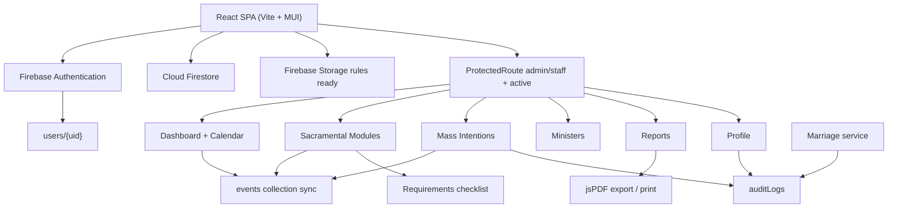

# Parish Connect - Church Management System

**Parish:** Immaculate Conception of the Virgin Mary Parish  
**Location:** Bani, Pangasinan  
**Document type:** System overview based on the current codebase implementation  
**Application version:** `0.0.0` (as declared in `package.json`)

> This document describes only features that exist in the implemented source code. Features that are placeholders, partially wired, or not present in the UI are labeled accordingly.

---

## System Overview

Parish Connect is a web-based church management system for parish office staff and administrators. It centralizes sacramental record-keeping, mass intention scheduling, minister maintenance, parish calendar coordination, and report generation for Immaculate Conception of the Virgin Mary Parish in Bani, Pangasinan.

**Intended users**

| Role | Access in the application |
|------|---------------------------|
| `admin` / `administrator` | Full application access (same screens as staff in the current UI) |
| `staff` | Full application access to operational modules |

**Overall objective**

Provide a secure, role-gated workspace where parish personnel can:

- Register and maintain baptism, confirmation, marriage, death, and conversion records
- Schedule and manage mass intentions
- Maintain an active minister list used across sacramental and intention forms
- Coordinate parish events through an integrated dashboard calendar
- Generate printable/PDF reports of sacramental and mass intention data
- Manage their own account profile and password

The system is a **client-side React SPA** backed by **Firebase Authentication**, **Cloud Firestore**, and **Firebase Storage** (Storage is configured; profile photo upload UI is not implemented).

---

## Current Features

### Dashboard

**Purpose**  
Operational home page (`/`) combining summary metrics, a monthly parish calendar, day schedule, upcoming events, and today’s mass intentions.

**Features**

- Summary cards:
  - Today’s Scheduled Sacraments (count of linked sacramental calendar events for today)
  - Baptismal / Confirmation / Marriage / Death / Conversion record counts
  - Mass Intention summary: Pending Intentions and Today’s Scheduled (status `Scheduled` with today’s mass date)
- Today’s Mass Intentions list (offered-for name, type, status, time)
- Full monthly calendar with day selection, day schedule, and upcoming events (next 4)
- Quick creation of new sacramental records and mass intentions from empty calendar dates
- Manual parish event create / edit / delete

**Workflow**

1. Staff signs in and lands on Dashboard.
2. Summary counts and calendar events load from Firestore.
3. User selects a date to view that day’s schedule.
4. User may add a manual event, or double-click an empty date to schedule a sacrament / mass intention.

**Business logic**

- Calendar is not a separate route; it lives on the Dashboard.
- Double-click scheduling is blocked when the selected day already has events.
- Sacramental/mass intention creation from the calendar uses **New Record** mode (auto numbering).

**Integrations**

- `events` collection via `eventService`
- Sacramental record counts via `dashboardService`
- Mass intentions for today’s panel
- Opens New Record form dialogs and Mass Intention form with date/time prefilled

---

### Calendar

**Purpose**  
Parish scheduling surface for manual events and automatically linked sacramental / mass intention events.

See [Calendar Integration](#calendar-integration) for full behavior.

---

### Authentication

**Purpose**  
Authenticate parish users with Firebase Email/Password and load their Firestore profile for role and status checks.

**Features**

- Login page (`/login`) with email and password
- Session restoration via Firebase `onAuthStateChanged`
- Firestore user document load from `users/{uid}`
- Role normalization (`administrator` → `admin`)
- `lastLogin` timestamp update after successful profile load
- Logout from Admin Layout, Profile, and Unauthorized pages
- Mapped login error messages (invalid credentials, disabled account, too many attempts)

**Workflow**

1. User submits credentials → `signInWithEmailAndPassword`.
2. Auth state change loads `users/{uid}`.
3. Role must be present; missing role surfaces a profile error.
4. On success, user is redirected to `/`.
5. Logout calls Firebase `signOut` and returns to `/login`.

**Important validations**

- Role is required on the user document.
- Protected routes require role in `admin` / `staff` and status `active` when status is set.

**Automatic processes**

- `touchLastLogin` updates `lastLogin` and `updatedAt` after successful profile load.

**Not implemented in UI**

- Forgot-password / reset-email link (service function `resetPassword` exists but is not wired to Login)

---

### User Management

**Purpose**  
Provision and administer parish user accounts.

**Current implementation status**

- **No User Management page, route, or navigation item exists in the React application.**
- Firestore security rules allow admins to create/update any `users/{userId}` document and read any user document.
- User provisioning is therefore outside the app UI (for example, Firebase Console / manual Firestore documents).
- The application consumes existing user documents for login, role, and status.

---

### User Profile

**Purpose**  
Allow signed-in users to view account metadata and update personal information and password (`/profile`).

**Features**

- Editable fields: first name, middle name, last name, phone, address, birthday, gender
- Read-only: email, role, account status, user ID, member since, last login, last password change
- Password change with re-authentication (current password required)
- Quick actions: Dashboard, Reports, Logout
- Avatar display from `photoURL` when present (no upload UI)

**Workflow**

1. Profile loads from Auth context / Firestore.
2. User edits personal fields → `updateUserProfile`.
3. Optional password change → reauth → `updatePassword` → update `lastPasswordChange`.
4. Audit logs written for profile update and password change.

**Important validations**

- First name, last name, and gender required
- Phone optional; when provided, validated (11-digit helper in UI)
- Birthday optional; cannot be in the future
- Password strength: minimum 8 characters including upper, lower, number, and special character
- Email, role, and status are not editable through the profile update service

**Notes**

- Profile page is labeled **Phase 1** in code comments.
- Firebase Storage rules allow `profilePhotos/{userId}/{fileName}`, but no client upload feature is implemented.

---

### Baptism Records

**Route:** `/records/baptism`  
**Collection:** `baptism`  
**Display number prefix:** `BR-YYYY-NNN`

**Purpose**  
Register and maintain baptismal records for children, including parents, godparents, minister, schedule, and documentary requirements.

**Features**

- Create, view, and update records (no delete)
- Dual create modes:
  - **Old Record** from the Baptism Records page (manual year/number; historical dates)
  - **New Record** from Dashboard calendar (auto next number for current year; today/future baptism date)
- Search across record number, names, dates, gender, legitimacy, residence, place of birth, godparents, minister, status, remarks, notes
- Filters: record years, genders, baptism years, legitimacies, ministers, requirements status
- Requirements checklist: Birth Certificate
- Lifecycle status on edit: `scheduled` / `completed` / `cancelled`
- Calendar sync on create/update
- Certificate button opens “under development” placeholder dialog

**Key stored fields**

Child name parts, father/mother names, date of birth, gender, legitimacy, place of birth, parents’ residence, godparents[], minister, baptism date/time, remarks, notes, requirements, requirements status, lifecycle status, record year/number/type, created/updated metadata.

**Important validations**

- Required child, parent, minister, baptism date, DOB, gender, places, legitimacy
- DOB cannot be after baptism date
- Godparent rows require first/last name and gender when present
- New vs Old date rules on add
- Duplicate `recordYear` + `recordNumber` rejected

**Automatic processes**

- New records: next number for current year; create status forced to `scheduled`
- Calendar event: `Baptism - {childName}` on `baptismDate`
- `requirementsStatus` derived from checklist

---

### Confirmation Records

**Route:** `/records/confirmation`  
**Collection:** `confirmation`  
**Display number prefix:** `CR-YYYY-NNN`

**Purpose**  
Register and maintain confirmation records for confirmands, sponsors, parents, and minister.

**Features**

- Create, view, update (no delete)
- Old Record (module page) / New Record (calendar)
- Search by record number, confirmand/parents/sponsors names, minister, place of baptism/birth
- Filters: record type, record years, requirements status
- Requirements checklist: Baptismal Certificate
- Age computed from date of birth; service requires age ≥ 13
- Calendar sync on create/update
- Certificate placeholder dialog

**Key stored fields**

Confirmand identity, gender, DOB, age, place of baptism, parents, male/female sponsors, minister, confirmation date/time, remarks, requirements, requirements status, record numbering/type, timestamps. Create sets status to `active`.

**Important validations**

- Confirmand, parents, both sponsors, minister, confirmation date, gender, DOB, place of baptism required
- Age must be an integer ≥ 13
- DOB ≤ confirmation date
- New/Old date rules on add
- Duplicate numbering rejected

---

### Marriage Records

**Route:** `/records/marriage`  
**Collection:** `marriage`  
**Display number prefix:** `MR-YYYY-NNN`

**Purpose**  
Register and maintain marriage records for groom and bride, sponsors, place, minister, and documentary requirements.

**Features**

- Create, view, update (no delete)
- Old / New record modes
- Search by record number, groom/bride, minister, marriage place, principal sponsors
- Filters: record type, record years, ministers, marriage dates, requirements status
- Requirements checklist: Birth Certificate, Baptismal Certificate, Confirmation Certificate, CENOMAR, Marriage License, Marriage Banns
- Calendar sync
- **Audit log entries** on create and update (`Created Marriage Record` / `Updated Marriage Record`)
- Certificate placeholder dialog

**Key stored fields**

Minister, marriage date/time/place, remarks, full groom/bride identity (ages, nationality, occupation, residence, civil status, parents), principal sponsors[], requirements, numbering/type, createdBy/updatedBy.

**Important validations**

- Minister, marriage date/place, full groom and bride party fields
- Birth dates ≤ marriage date; ages non-negative integers
- Occupation “Others” requires other text
- Sponsor rows require first/last when present
- New/Old date rules; duplicate numbering rejected

---

### Death Records

**Route:** `/records/death`  
**Collection:** `death`  
**Display number prefix:** `DR-YYYY-NNN`

**Purpose**  
Register and maintain death / burial records, including deceased identity, related person, residence, burial details, and last sacraments.

**Features**

- Create, view, update (no delete)
- Old / New record modes
- Search by name, record number, minister, civil status, relationship, related person, residence
- Filters: record type, record years, ministers, civil statuses, death dates, provinces, requirements status
- Requirements checklist: Death Certificate
- Calendar sync uses **burial date** (not date of death)
- Certificate placeholder dialog

**Key stored fields**

Deceased identity, gender, DOB, age, civil status (`status` field), relationship and related person, residence (province/municipality/barangay), date of death, burial date, place of burial, received last sacraments, sickness, remarks, minister, time, requirements, numbering/type, actor metadata.

**Important validations**

- Minister, identity, civil status, relationship/related person, residence, burial date/place, last sacraments required
- Burial date ≥ date of death; DOB ≤ death date
- New-record add requires burial date today or future; old-record add requires past death date
- Age ≥ 0 integer

---

### Conversion Records

**Route:** `/records/conversion`  
**Collection:** `conversion`  
**Display number prefix:** `CVR-YYYY-NNN`

**Purpose**  
Register and maintain reception / conversion records into the Catholic Church.

**Features**

- Create, view, update (no delete)
- Old / New record modes
- Search by record number, convert name, receiving minister, denomination, original baptism place
- Filters: record years, receiving ministers, denominations, requirements status
- Requirements checklist: Birth Certificate, Baptismal Certificate
- Calendar sync on `dateOfReception` with fixed time `08:00`
- Certificate placeholder dialog

**Key stored fields**

Convert identity, residence, parents, date of reception, receiving minister, original baptism date (optional), denomination, place, observanda, requirements, numbering/type, actor metadata. No lifecycle status field; no time field on the record itself.

**Important validations**

- Names, residence, parents, reception date, receiving minister, original baptism denomination and place required
- Original baptism date optional
- New/Old sacrament-date rules on add
- Duplicate numbering rejected

---

### Mass Intentions

**Route:** `/mass-intentions`  
**Collection:** `massIntentions`  
**Display number prefix:** `MI-YYYY-NNN`

See [Mass Intentions](#mass-intentions) for the complete workflow.

**Summary of capabilities**

- Full CRUD including delete
- Search and filters (status, intention type, month, year)
- Pagination (page size 10)
- Dynamic recipient fields by intention type
- Celebrant selection from active ministers
- Calendar synchronization (including delete cleanup)
- Audit logging for create, update, status change, and delete

---

### Ministers Management

**Route:** `/ministers` (legacy `/maintenance/ministers` redirects here)  
**Collection:** `ministers`

**Purpose**  
Maintain the parish minister directory used by sacramental forms, mass intentions, and report filters.

**Features**

- Create, view, update (no delete in UI or service)
- Search
- Filters: status, position, assignment
- Title/position compatibility rules
- Multi-select sacrament assignments

**Fields**

`name`, `title`, `position`, `phone`, `email`, `assignments[]`, `status`, timestamps, createdBy/updatedBy (plus legacy `parish` / `parishAssignment` mirrors).

**Title options**

`Rev. Fr.`, `Fr.`, `Bishop`, `Archbishop`, `Msgr.`, `Rev.`, `Deacon`, `Bro.`, `Sister`  
Default title: `Rev. Fr.`

**Assignment options**

`Baptism`, `Confirmation`, `Marriage`, `Burial`, `Conversion`

**Statuses**

`active` / `retired` / `inactive` (labels: Active / Retired / Inactive)

**Business logic**

- Display name formatted as `{title} {name}`
- Only **Active** ministers are assignable in forms
- `MinisterField` filters by sacrament assignment where applicable
- Mass Intention celebrant field loads all active ministers (no assignment filter)
- Death records use assignment `"Burial"`

**Important validations**

- Name, title, position (must match title map), at least one assignment, phone required
- Email optional but validated when present

---

### Reports

**Route:** `/reports`  
**Collection for metadata:** `reports`

See [Reports](#reports-1) for every report type and summarized columns.

**Features**

- Generate report by type, year, month, and optional minister
- On-screen preview dialog
- Export PDF (`jsPDF` + `jspdf-autotable`)
- Print via `window.print`
- Recent Reports history with View (regenerates from stored filters)
- Parish header: Immaculate Conception of the Virgin Mary Parish, Bani, Pangasinan

---

### Audit Logs

**Purpose**  
Persist security/activity trail entries in Firestore `auditLogs`.

**Implemented write actions**

| Action | Module |
|--------|--------|
| Updated Profile | Profile |
| Changed Password | Profile |
| Created Marriage Record | Marriage |
| Updated Marriage Record | Marriage |
| Created Mass Intention | Mass Intentions |
| Updated Mass Intention | Mass Intentions |
| Changed Mass Intention Status | Mass Intentions |
| Deleted Mass Intention | Mass Intentions |

**Features / constraints**

- Required fields: `action`, `module`, `performedBy`, `performedByUid`, `timestamp`
- Failures are swallowed (console-logged) so they do not block primary operations
- Firestore: create allowed for staff/admin; read allowed for admin only; update/delete denied
- **No in-app Audit Log viewer page exists**

**Document-level audit fields**

Many records also store `createdBy`, `updatedBy`, `createdAt`, `updatedAt` shown in View dialogs under Audit Information (coverage varies by module; Confirmation create path does not write actor fields in its document builder).

---

### Search

**Purpose**  
Client-side substring search over loaded records within each module page.

**Implemented on**

- Baptism, Confirmation, Marriage, Death, Conversion record pages
- Mass Intentions
- Manage Ministers

Search fields differ per module (names, record numbers, ministers, dates, statuses, places, etc.). Lists are typically loaded with a full collection scan and filtered in memory.

---

### Filters

**Purpose**  
Multi-select / structured filters via shared `FilterSection` UI on record modules, plus dedicated filters on Mass Intentions, Ministers, and Reports.

**Examples**

| Module | Filter dimensions |
|--------|-------------------|
| Baptism | Years, genders, baptism years, legitimacies, ministers, requirements status |
| Confirmation | Record type, record years, requirements status |
| Marriage | Record type, record years, ministers, marriage dates, requirements status |
| Death | Record type, record years, ministers, civil statuses, death dates, provinces, requirements status |
| Conversion | Record years, receiving ministers, denominations, requirements status |
| Mass Intentions | Status, intention type, month, year |
| Ministers | Status, position, assignment |
| Reports | Report type, year (current + previous 9), month, minister |

---

### Record Numbering

**Purpose**  
Canonical yearly sequence numbers stored as numeric `recordYear` + `recordNumber`, displayed with module prefixes.

| Module | Display format | Example |
|--------|----------------|---------|
| Baptism | `BR-YYYY-NNN` | `BR-2026-001` |
| Confirmation | `CR-YYYY-NNN` | `CR-2026-001` |
| Marriage | `MR-YYYY-NNN` | `MR-2026-001` |
| Death | `DR-YYYY-NNN` | `DR-2026-001` |
| Conversion | `CVR-YYYY-NNN` | `CVR-2026-001` |
| Mass Intention | `MI-YYYY-NNN` | `MI-2026-001` |

**Rules**

- Sequence resets per year (max existing number for that year + 1)
- **New** records: auto-assigned for the current calendar year
- **Old** records: user enters year and number manually
- Duplicate year + number combinations are rejected (excluding the record being edited)

---

### Validation

**Purpose**  
Shared and module-specific validation for forms and service-layer payloads.

**Shared patterns** (`validation.js` and form dialogs)

- Required field checks
- Name format helpers
- Record number / year validation
- New vs Old sacrament-date rules (new = today or future; old = past)
- Cross-date rules (e.g., birth ≤ sacrament date; burial ≥ death)
- Age rules (confirmation ≥ 13; marriage/death ages non-negative integers)
- Duplicate record number checks
- Philippine place completeness (province / municipality / barangay)
- Phone validation where applicable
- Unsaved-changes confirmation before closing dirty dialogs

Incomplete requirements **never block save**; they only affect `requirementsStatus`.

---

### Requirements Checklist

**Purpose**  
Track documentary submission status without file uploads.

| Sacrament | Checklist items |
|-----------|-----------------|
| Baptism | Birth Certificate |
| Confirmation | Baptismal Certificate |
| Marriage | Birth Certificate, Baptismal Certificate, Confirmation Certificate, CENOMAR, Marriage License, Marriage Banns |
| Death | Death Certificate |
| Conversion | Birth Certificate, Baptismal Certificate |

**Behavior**

- Boolean checklist only (no document upload)
- Stores `requirements` map and derived `requirementsStatus` (`complete` / `incomplete`)
- UI chip via `RequirementsStatusChip`
- Reports show `✔ Complete` or `⚠ Incomplete (n of total Submitted)`

---

### Role-based Access

**Purpose**  
Restrict application and data access to authorized parish roles.

**Application layer**

- All operational routes wrapped in `ProtectedRoute` with `allowedRoles={['admin', 'staff']}`
- Unauthorized users redirected to `/unauthorized`
- Inactive users (status present and not `active`) redirected to `/unauthorized`
- Missing/empty status is allowed
- Profile load errors show a retry screen rather than unauthorized
- Navigation is identical for admin and staff (no admin-only screens in the current UI)

**Firestore rules**

- `isAdmin`: active + role `admin` or `administrator`
- `isStaffOrAdmin`: active + `admin` / `administrator` / `staff`
- Operational collections writable by staff/admin
- Audit log reads admin-only
- User self-update cannot change `role`, `email`, or `status`

---

### Notifications

**Purpose**  
User feedback for actions and errors.

**Implemented**

- MUI `Snackbar` / `Alert` messages across Login, Dashboard, Profile, Reports, Unauthorized, and record modules
- Success/error/info toasts for create/update/delete, validation, logout failures, etc.

**Not implemented**

- Push notifications / Firebase Cloud Messaging client usage
- In-app notification center / unread notification feed
- Email notifications from the application UI

(`VITE_FIREBASE_MESSAGING_SENDER_ID` is present for Firebase config only.)

---

### Dialogs

| Dialog / component | Role |
|--------------------|------|
| `BaptismRecordFormDialog` (+ Old/New wrappers) | Add/edit baptism |
| `ConfirmationRecordFormDialog` | Add/edit confirmation |
| `MarriageRecordFormDialog` | Add/edit marriage |
| `DeathRecordFormDialog` | Add/edit death |
| `ConversionRecordFormDialog` | Add/edit conversion |
| `MassIntentionFormDialog` | Add/edit/view mass intention |
| `EventFormDialog` | Manual event create/edit; linked events read-only |
| `ScheduleSacramentDialog` | Choose sacrament/intention type from calendar |
| `ReportPreviewDialog` | Preview generated report |
| `CertificateComingSoonDialog` | Certificate generation placeholder |
| `UnsavedChangesDialog` | Confirm discard of dirty forms |
| Module View dialogs | Read-only record details on each records page |
| Delete confirmations | Manual events and mass intentions |

---

### Reusable Components / Features

| Component / utility | Use |
|---------------------|-----|
| `AdminLayout` | Shell, sidebar nav, account menu, theme |
| `PageHeader` | Consistent page titles |
| `NameField` | Structured person name inputs |
| `MinisterField` | Active minister picker (+ Other free text) |
| `PlaceSelect` / `ResidencePlaceSelect` | Philippine place cascading selects (`phil-reg-prov-mun-brgy`) |
| `GenderSelect` | Gender options |
| `TimeSelect` | Parish time options |
| `FormSection` / `FormFieldSubheading` | Form layout |
| `RequirementsChecklist` / `RequirementsStatusChip` | Documentary requirements UI |
| `recordUi/*` | Detail sections, filter section, empty state |
| `CertificateGenerationPrep` | Certificate button + coming-soon dialog |
| `ReportTemplate` / `unifiedReportDocument` | Shared report layout |
| `useUnsavedChanges` | Dirty-form guard hook |
| `parishTheme` | Marian blue MUI theme |
| Shared utils | `recordNumber`, `validation`, `personName`, `date`, `parishCalendar`, `calendarColors`, `philippinePlaces`, `displayValue`, `formValidationSummary` |

---

## Calendar Integration

### How it works

The calendar is embedded in the Dashboard. It loads all documents from the Firestore `events` collection (ordered by date/time) and renders:

- Monthly grid with up to 4 color dots per day
- Selected-day schedule sorted by time
- Upcoming events (limit 4 after the selected day)
- Add Event for manual parish activities

### Modules that automatically create calendar entries

| Source module | Event `source` | Title pattern | Date used | Time |
|---------------|----------------|---------------|-----------|------|
| Baptism | `baptism` | `Baptism - {child}` | `baptismDate` | record time or `08:00` |
| Confirmation | `confirmation` | `Confirmation - {confirmand}` | `confirmationDate` | record time or `08:00` |
| Marriage | `marriage` | `Marriage - {groom} & {bride}` | `marriageDate` | record time or `08:00` |
| Death | `death` | `Death - {deceased}` | **`burialDate`** | record time or `08:00` |
| Conversion | `conversion` | `Conversion - {convert}` | `dateOfReception` | always `08:00` |
| Mass Intention | `massIntention` | `Mass Intention` | `massDate` | mass time |

Synchronization is performed by `syncSacramentalEvent`, which upserts by `relatedRecordId` + `source` and deletes duplicate linked events.

### Manual events

- `source: 'manual'`, `relatedRecordId: null`
- Categories/titles: Batch Baptism, Holy Mass, Parish Meeting, Seminar, Fiesta, Novena, Procession, Wedding Rehearsal, Funeral Service, Others
- Others requires a custom title (stored as `title`; `category` = `Others`)
- Required: title/category, date, time; description optional
- Editable and deletable from the day schedule

### Linked events

- Linked events store `source` and `relatedRecordId`
- UI marks them as linked / sacramental and opens them **read-only** in `EventFormDialog`
- Mass Intention linked descriptions include Intention Type, Offered For, and Celebrant

### Synchronization

- Create/update of the six source modules calls `syncSacramentalEvent`
- Sync failures are logged and do **not** roll back the source record write
- Duplicate linked events for the same record/source are cleaned up on sync

### Color coding

| Source | Color |
|--------|-------|
| Baptism | `#1565C0` |
| Confirmation | `#2E7D32` |
| Marriage | `#6A1B9A` |
| Death | `#616161` |
| Conversion | `#EF6C00` |
| Mass Intention | `#00838F` |
| Manual | `#0B3D91` |

### Update behavior

- Updating a source record re-syncs its linked calendar event (title, date, time, description)
- Manual events update only the event document via `updateEvent`

### Delete behavior

- Manual events: deletable via Dashboard; sacramental/linked events cannot be deleted directly (`EVENT_SACRAMENTAL_LOCKED`)
- Mass Intention delete: removes linked calendar events via `deleteEventsByRelatedRecord`
- Sacramental record modules have **no delete API**, so their linked events are not removed by a record-delete path

---

## Mass Intentions

### Workflow

1. Staff opens Mass Intentions (`/mass-intentions`) or schedules from Dashboard calendar.
2. Form captures mass date/time, intention type, recipient type/fields, requester, celebrant, residence, contact, status, remarks.
3. On save, system assigns/validates intention number (`MI-YYYY-NNN`), writes Firestore document, syncs calendar event, and writes an audit log.
4. Users may view, edit, change status, or delete intentions.
5. Delete removes the record and linked calendar event(s).

### Intention types

- Soul of the Deceased  
- Thanksgiving  
- Healing  
- Birthday  
- Wedding Anniversary  
- Death Anniversary  
- Special Intention  
- Others  

### Dynamic fields / recipient rules

| Intention type | Allowed recipient types |
|----------------|-------------------------|
| Soul of the Deceased | individual, other |
| Thanksgiving | individual, couple, family, organization, other |
| Healing | individual, couple, family, organization, other |
| Birthday | individual, family |
| Wedding Anniversary | couple |
| Death Anniversary | individual, other |
| Special Intention | individual, couple, family, organization, other |
| Others | individual, couple, family, organization, other |

**Fields by recipient type**

- **individual:** first / middle / last / suffix  
- **couple:** spouse 1 + spouse 2 name parts  
- **family:** `familyName`  
- **organization:** `organizationName`  
- **other:** `offeredForDescription`  
- Intention type **Others** also requires `otherIntention`

Changing intention type auto-syncs an allowed recipient type.

### Name logic

- **Offered For** display via `getOfferedForDisplayName` (couple → `A & B`; family/org/other → dedicated fields; else individual)
- **Requester** display via `getRequesterDisplayName`
- Intention number auto-generated on create

### Family / Organization support

Supported through recipient types `family` and `organization` with required `familyName` / `organizationName` when selected.

### Calendar synchronization

- Create/update → linked event titled `Mass Intention`
- Delete → linked events removed
- Sync errors do not undo the intention write

### Celebrant assignment

- Required `celebrantName` via `MinisterField` (all active ministers)
- Form sends `celebrantId` as empty string
- Free-text “Other” minister name supported

### Status

`Pending` (default), `Scheduled`, `Offered`, `Cancelled`

### Remarks

Optional multiline remarks stored and shown in the View dialog under Mass Information.

### Validation

- Mass date/time, intention type, recipient fields per type, requester first/last, celebrant, status, complete residence
- Contact number optional; if present must satisfy phone rules
- Recipient type must be allowed for intention type
- Duplicate intention number rejected
- Mass times limited to parish options: `08:00`–`11:30` and `13:00`–`17:00` in 30-minute steps

---

## Sacramental Records

Shared architecture across Baptism, Confirmation, Marriage, Death, and Conversion.

### Common architecture

- Dedicated page + form dialog + service per sacrament
- Firestore collections: `baptism`, `confirmation`, `marriage`, `death`, `conversion`
- CRUD: **Create / Read / Update only** (no delete functions or UI)
- Dual entry:
  - Module page → Old Record (manual numbering, historical dates)
  - Dashboard calendar → New Record (auto numbering, today/future date rules)
- Full collection fetch + in-memory search/filter/sort
- Shared UI kit: filters, detail sections, requirements, certificate placeholder, unsaved-changes guard

### Record numbering

See [Record Numbering](#record-numbering). New records use current year max sequence + 1; old records accept manual year/number with uniqueness checks.

### Requirements

See [Requirements Checklist](#requirements-checklist). Incomplete never blocks save.

### Audit trail

- Document metadata (`createdBy` / `updatedBy` / timestamps) on most modules
- Central `auditLogs` writes currently implemented for **Marriage** create/update only among sacramental modules
- No sacramental Audit Log viewer in the app

### Search and filters

Implemented per module as listed in Current Features.

### Edit workflow

1. Open View dialog from the table  
2. Choose Edit  
3. Modify fields in form dialog (`mode="edit"`)  
4. Save → service `update*Record` → calendar re-sync  
5. Dirty close prompts via unsaved-changes confirmation  

### Delete policy

**Sacramental records cannot be deleted** through the application. There is no soft-delete/archive workflow in the sacramental services.

### Validation

Shared new/old date rules, required identity fields, minister, places, cross-date constraints, ages where applicable, and duplicate numbering. Module-specific rules are listed under each sacrament.

### Generated fields

- Auto record year/number for New Records  
- Derived `requirementsStatus`  
- Computed ages (confirmation from DOB; marriage/death age helpers)  
- Place string fields from Philippine place pickers  
- Server timestamps  
- Linked calendar events  
- Baptism create forces lifecycle status `scheduled`  
- Confirmation create sets status `active`  

### Certificate generation

UI buttons exist (“Generate … Certificate”), but they open `CertificateComingSoonDialog` stating the feature is under development. No certificate PDF generation is implemented for sacraments.

---

## Reports

### Available report types

| Report key | UI label | Report title |
|------------|----------|--------------|
| `baptism` | Baptism | Baptism Records Report |
| `confirmation` | Confirmation | Confirmation Records Report |
| `marriage` | Marriage | Marriage Records Report |
| `death` | Death | Death Records Report |
| `conversion` | Conversion | Conversion Records Report |
| `massIntention` | Monthly Mass Intentions | Monthly Mass Intentions Report |
| `massIntentionDaily` | Daily Mass Intentions | Daily Mass Intentions Report |
| `massIntentionWeekly` | Weekly Mass Intentions | Weekly Mass Intentions Report |
| `massIntentionPending` | Pending Intentions | Pending Mass Intentions Report (`Pending`) |
| `massIntentionScheduled` | Scheduled Intentions | Scheduled Mass Intentions Report (`Scheduled`) |
| `massIntentionOffered` | Offered Intentions | Offered Mass Intentions Report (`Offered`) |

> Daily / Weekly / Monthly Mass Intention variants share the same query and columns. They differ by label, title, and file prefix. Pending/Scheduled/Offered variants add a status filter.

### Data summarized

**Sacramental reports** (filtered by year, optional month, optional minister):

| Report | Columns |
|--------|---------|
| Baptism | Record Number, Child Name, Baptism Date, Minister, Requirements Status |
| Confirmation | Record Number, Confirmand Name, Confirmation Date, Minister, Requirements Status |
| Marriage | Record Number, Groom, Bride, Marriage Date, Minister, Requirements Status |
| Death | Record Number, Deceased Name, Burial Date, Minister, Requirements Status |
| Conversion | Record Number, Convert Name, Reception Date, Minister, Requirements Status |

**Mass Intention reports:**

Intention Number, Offered For, Mass Date, Mass Time, Intention Type, Celebrant, Status

### Filters

- Report Type  
- Year (current year and previous 9 years)  
- Month (`All Months` or January–December)  
- Minister (`All Ministers` or active ministers for the report’s assignment)

No free-form custom date-range picker is implemented.

### Export / preview

- Preview dialog with unified parish template (logo, parish name, “Church Management System”, summary, table, “End of Report”, Prepared By)
- PDF export and Print
- Empty results disable PDF/Print
- After PDF export, metadata is saved to the `reports` collection (`format: 'PDF'`)
- No Excel/CSV export is implemented in the report services

---

## Security

### Firebase Authentication

- Email/password sign-in
- Session observed via `onAuthStateChanged`
- Password change requires re-authentication
- Password reset email helper exists in `authService` but is not exposed in the Login UI
- Disabled accounts and rate-limit errors are mapped to user-friendly messages

### Firestore

Collections used by the app:

`users`, `baptism`, `confirmation`, `marriage`, `death`, `conversion`, `massIntentions`, `events`, `ministers`, `reports`, `auditLogs`

Security rules enforce:

- Signed-in active admin/staff for operational collections
- User document self-update limited to personal profile keys; role/email/status immutable on self-update
- User create: admin only; user delete: denied
- Audit logs: admin read; staff/admin create with `performedByUid == auth.uid`; no update/delete

### Storage

Rules for `profilePhotos/{userId}/{fileName}`:

- Owner read/delete
- Owner create/update for jpeg/png/webp ≤ 5 MB  

No profile photo upload UI is present in the application.

### Route protection

- Public: `/login`, `/unauthorized`
- All admin shell routes require authenticated `admin` or `staff` with active status (when status is set)
- Lazy-loaded pages behind `Suspense`

### Role validation

- Normalized roles: `admin`, `staff` (alias `administrator` → `admin`)
- Enforced in `ProtectedRoute` and Firestore helpers

### User status validation

- If Firestore `status` is present and not `active`, access is denied
- Missing/empty status is treated as allowed

### Audit logging

See [Audit Logs](#audit-logs). Logging is partial (profile, password, marriage, mass intentions) and has no viewer UI.

### Other application security behaviors

- Sacramental calendar events cannot be deleted from the calendar UI
- Profile service refuses to write role/email
- Client-side validation complements service-layer validation
- Environment secrets via Vite `VITE_FIREBASE_*` variables (see `.env.example`)

---

## Technology Stack

### Frontend

- React 19
- Vite 8
- React Router DOM 7
- Material UI (MUI) 9 + Emotion
- MUI Icons
- Custom Marian-blue parish theme

### Backend

- No custom application server in this repository
- Firebase client SDK provides Auth, Firestore, and Storage access from the browser

### Database

- Cloud Firestore

### Storage

- Firebase Storage (configured; profile photo path rules exist)

### Libraries (used in application code)

| Library | Usage |
|---------|-------|
| `firebase` | Auth, Firestore, Storage |
| `@mui/material` / `@mui/icons-material` / Emotion | UI |
| `react-router-dom` | Routing |
| `jspdf` + `jspdf-autotable` | Report PDF export |
| `phil-reg-prov-mun-brgy` | Philippine region/province/municipality/barangay data |

**Declared in `package.json` but not imported by `src` in the current codebase:** `sweetalert2`, `react-hook-form`, `react-icons`.

### Tooling

- `oxlint` for linting
- Vite build / preview scripts

### Deployment

- `vercel.json` SPA rewrite (`/(.*) → /index.html`) indicates Vercel-oriented hosting configuration
- `firebase.json` configures Firestore and Storage rules deployment (no Hosting/Functions config in that file)

---

## Current Development Status

### Implemented Features

- Email/password authentication with role and status gates
- Admin layout navigation for Dashboard, Sacramental Records, Mass Intentions, Manage Ministers, Reports, Profile
- Dashboard summary metrics + parish calendar + day/upcoming schedules
- Manual calendar events (create/edit/delete)
- Automatic calendar linking for baptism, confirmation, marriage, death, conversion, mass intentions
- Baptism, Confirmation, Marriage, Death, Conversion registries (create/view/edit, search, filters, requirements)
- Mass Intentions full CRUD with dynamic recipient logic and calendar sync
- Ministers create/view/edit with assignments and status
- Reports generation, preview, PDF export, print, recent history
- User profile personal info update and password change
- Partial audit logging (profile, password, marriage, mass intentions)
- Firestore and Storage security rules
- Philippine place selectors and parish time options
- Unsaved-changes protection on forms
- Certificate generation entry points (placeholder only)

### In Progress

Features explicitly marked incomplete in code/UI:

- **Certificate generation** — dialog states it is under development / template not finalized
- **User Profile Phase 1** — personal profile implemented; further profile phases not present
- **Password reset email** — service exists, Login UI not wired
- **Profile photo storage rules** — ready; upload UI not implemented
- **Audit logging coverage** — implemented for some modules only; no viewer UI
- **User Management UI** — rules allow admin user create/update, but no management screen exists

### Coming Soon

Explicitly communicated to users in the UI:

- Sacramental certificate generation (“This feature will become available in a future update.”)

No other “Coming Soon” product roadmap screens were found in the application.

---

## Future Enhancements

Recommendations based on the current architecture. These are **not** implemented today.

1. **Certificate generation** — Finalize printable/PDF templates already stubbed in the UI for each sacrament.
2. **User Management module** — Admin UI to create, activate/deactivate, and assign roles, aligning with existing Firestore admin rules.
3. **Audit Log viewer** — Admin page to read `auditLogs` (rules already allow admin read).
4. **Broader audit coverage** — Extend `createAuditLog` to baptism, confirmation, death, conversion, ministers, events, and reports for consistent accountability.
5. **Forgot password UI** — Wire `authService.resetPassword` into Login.
6. **Profile photo upload** — Use existing Storage rules and `photoURL` field.
7. **Sacramental delete / archive policy** — Define soft-archive behavior and linked calendar cleanup (today only mass intentions delete linked events).
8. **Role-differentiated UX** — Optional admin-only screens (users, audit) while keeping staff on operational modules.
9. **Server-side query optimization** — Replace full-collection scans with indexed Firestore queries for large datasets.
10. **Report enhancements** — True daily/weekly date windows, Excel/CSV export, and richer filters.
11. **Notification center** — Persist important operational alerts beyond transient snackbars.
12. **Confirmation actor metadata parity** — Align Confirmation create/update with other modules’ `createdBy` / `updatedBy` fields.

---

## Application Routes

| Path | Access | Screen |
|------|--------|--------|
| `/login` | Public | Login |
| `/unauthorized` | Public | Unauthorized / access denied |
| `/` | admin, staff | Dashboard + Calendar |
| `/records/baptism` | admin, staff | Baptismal Records |
| `/records/confirmation` | admin, staff | Confirmation Records |
| `/records/marriage` | admin, staff | Marriage Records |
| `/records/death` | admin, staff | Death Records |
| `/records/conversion` | admin, staff | Conversion Records |
| `/mass-intentions` | admin, staff | Mass Intentions |
| `/ministers` | admin, staff | Manage Ministers |
| `/maintenance/ministers` | admin, staff | Redirect → `/ministers` |
| `/reports` | admin, staff | Reports |
| `/profile` | admin, staff | Profile / Account |
| `*` (inside shell) | admin, staff | Not Found |

---

## High-Level Architecture

---

## Document Control

This overview was generated from the Parish Connect repository implementation, including pages, services, constants, Firebase rules, and deployment config files. Any capability not described above should be treated as **not present** unless verified again against the source code.
